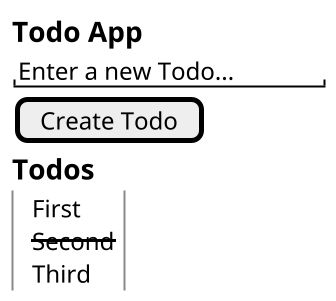

---
# You can also start simply with 'default'
theme: enolive
# some information about your slides (markdown enabled)
title: TDD in Frontend
info: |
  ## Slides for my talk how using TDD in frontend drives you towards accessibility

  Find my code on [GitHub](https://github.com/enolive/frontend-tdd)
# https://sli.dev/features/drawing
drawings:
  persist: false
# slide transition: https://sli.dev/guide/animations.html#slide-transitions
transition: slide-left
# enable MDC Syntax: https://sli.dev/features/mdc
mdc: true
src: ./intro.md
---

---
src: ./about.md
---

---
layout: fact
---

# Disclaimer

I am not an accessibility expert!

---
transition: slide-up
---

# Why Accessibility?

* European Accessibility Act (2019)
* 🇩🇪 BFSG (2026)
* ~ 15% people have some kind of disabilities
* demographic change
* inclusion

---

# In Web Apps

* <span v-mark.orange>Semantic HTML</span>
* **Meaningful** <span v-mark.orange>Alternative Text</span>
* Color & contrast
* Keyboard Navigation
* ...

---
layout: two-cols-header
transition: slide-up
---

# Why TDD?

::left::

<div class="fade">

<v-clicks>

* Create testable code in short cycles
* 100% Coverage guaranteed
* Lower defect rate
* Higher confidence on changes
* Documentation

</v-clicks>

</div>

::right::

{width=70%}

---

# How?

<div class="fade">

<v-clicks>

1. Test that fails
2. Implement to make it succeed
3. Clean up your mess
4. GOTO 1
5. Profit!

</v-clicks>

</div>

---
transition: slide-up
---

# TDD in Frontend

* Testing very similar to assistive technologies
* Tooling highly opinionated towards ARIA roles & attributes
* [Testing Library](https://testing-library.com/)


---
layout: fact
transition: slide-up
---

# Hypothesis

TDD drives the frontend towards basic accessibility!

---
transition: slide-up
---

# Testing Library

<div class="fade">

<v-clicks>

- test components as the user experiences them
- one of the most popular frontend libs
- available for most SPA technologies
- component testing in JSDOM
- inspiration for E2E testing with Playwright

</v-clicks>

</div>

---

# Example

```tsx
import { render, screen } from '@testing-library/react'
import App from './App'

describe('Todo App', () => {
 it('shows header', () => {
    render(<App />)

    const header = screen.getByRole('heading', { level: 1 })
    expect(header).toHaveTextContent('Todo App')
  })
})
```

---
layout: two-cols-header
transition: slide-up
---

# Scope of this talk

::left::

- Simple TODO App
- Read and Create
- React
- Mocked API via MSW

::right::

<v-click>



</v-click>

---

# Out of scope

<div class="fade">

<v-clicks>

- testable component architecture
- mocks vs nullables
- E2E Testing
- further A11y testing
- fancy CSS

</v-clicks>

</div>

---
layout: image
image: /coding-unsplash.png
---

# Let's start coding...

---
src: ./thanks.md
---
