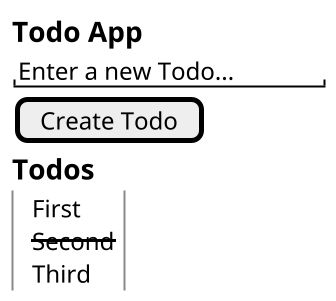

---
# You can also start simply with 'default'
theme: enolive
# some information about your slides (markdown enabled)
title: TDD in Frontend
info: |
  ## Slides for my talk how using TDD in frontend drives you towards accessibility

  Find my code on [GitHub](https://github.com/enolive/frontend-tdd)
# https://sli.dev/features/drawing
drawings:
  persist: false
# slide transition: https://sli.dev/guide/animations.html#slide-transitions
transition: slide-left
# enable MDC Syntax: https://sli.dev/features/mdc
mdc: true
src: ./intro.md
---

---
src: ./about.md
---

---
layout: fact
---

# Disclaimer

I am not an accessibility expert!

---
transition: slide-up
class: fade text-3xl
---

# Why Accessibility?

<v-clicks>

* European Accessibility Act (2019)
* 🇩🇪 BFSG (June 2025)
* ~ 15% people have some kind of disabilities
* demographic change
* inclusion

</v-clicks>

---
transition: slide-up
class: text-2xl
---

# In Web Apps

* <span v-mark.orange>Semantic HTML</span>
* **Meaningful** <span v-mark.orange>Alternative Text</span>
* Color & contrast
* Keyboard Navigation
* Responsive Design
* ...

---

# Did you know?

You can turn on a full-page accessibility tree in chromium based browsers


<style>
  img {
    width: 500px;
  }
</style>

---
layout: two-cols-header
transition: slide-up
class: text-2xl fade
---

# Why TDD?

::left::

<v-clicks>

* Create testable code in short cycles
* 100% Coverage guaranteed
* Lower defect rate
* Higher confidence on changes
* Documentation

</v-clicks>

::right::

{width=70%}

---
class: text-3xl fade
---

# How?

<v-clicks>

1. Test that fails
2. Implement to make it succeed
3. Clean up your mess
4. GOTO 1
5. Profit!

</v-clicks>

---
transition: slide-up
class: text-4xl fade
---

# TDD in Frontend

<v-clicks>

* Testing very similar to assistive technologies
* Tooling highly opinionated towards ARIA roles & attributes
* [Testing Library](https://testing-library.com/)

</v-clicks>

---
layout: fact
transition: slide-up
---

# Hypothesis

TDD drives the frontend towards basic accessibility!

---
transition: slide-up
class: text-3xl fade
---

# Testing Library

<v-clicks>

- test components as the user experiences them
- one of the most popular frontend (testing) libs [Source](https://2024.stateofjs.com/en-US/libraries/#tier_list)
- available for most ui frameworks
- component testing in JSDOM
- inspiration for E2E testing with [Playwright](https://playwright.dev/)

</v-clicks>

---

# Example

```tsx{all|4,5,7-}
import {render, screen} from '@testing-library/react'
import App from './App'

describe('Todo App', () => {
    it('displays header', () => {
        render(<App/>)

        const header = screen.getByRole('heading', {level: 1})
        expect(header).toHaveTextContent('Todo App')
    })
})
```

---
layout: two-cols-header
transition: slide-up
class: text-3xl
---

# Scope of this talk

::left::

- Simple TODO App
- Read and Create
- React
- Mocked API via MSW

::right::

<v-click>



</v-click>

---
layout: two-cols
class: text-3xl fade
---

# Out of scope

<v-clicks>

- testable component architecture
- mocks vs [nullables](https://www.jamesshore.com/v2/projects/nullables/testing-without-mocks)
- E2E Testing
- further A11y testing
- fancy CSS

</v-clicks>

::right::

<div v-click v-motion
  :initial="{ x: -100, y: 1000 }"
  :enter="{ x: 0, y: 0 }"
>


{width=350px}

</div>

<style>
    .grid-cols-2 {
        grid-template-columns: 2fr 1fr;
    }
</style>

---
layout: image
image: /coding-unsplash.png
---

# Let's start coding...

---
src: ./thanks.md
---
